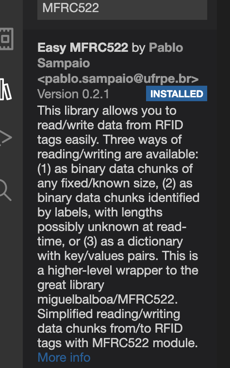
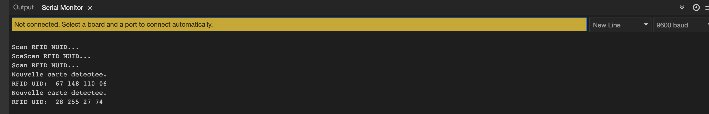

# Application IoT : la technologie RFID

## **Installer la bibliotheque MFRC522 :**
***Installation de la bibliotheque MFRC522***

{width=2in}

## **Programme lecture de l'UID :**

***Lecture des numeros d'dentification des deux (2) cartes *** 
1. Carte: 67 148 110 06 
2. Porte clef: 28 255 27 74 

Voir la capture ci-dessous:

{width=2in}

