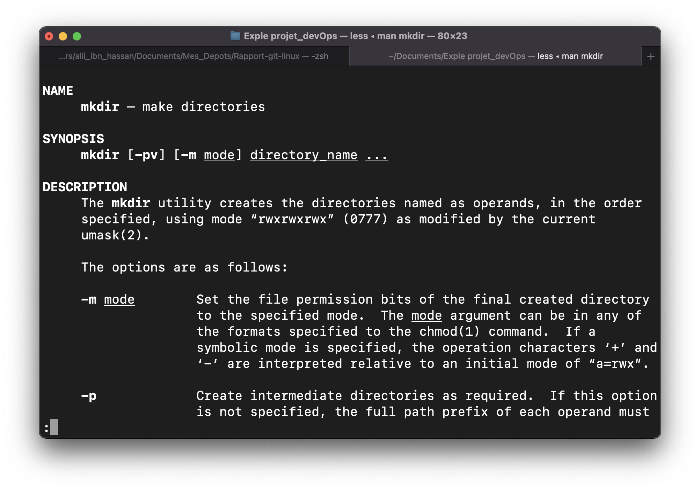

# Rapport sur les commandes GIT et LINUX

# Les commandes linux:
1. La commande LS:
- Description:
La commande LS permet de lister le contenu du répertoire courant: fichiers et autres répertoires imbriqués.
- _Eemple d'utilisation:

{width=2in}

2. La commande PWD:
- Description: 
Elle permet d'afficher le répertoire de travail et donne le chemin absolu du répertoire dans lequel vous vous trouvez.
PWD "Print Working Directory". 
- _Exemple d'utilisation:

{width=2in}

3. La commande CD:
- Description: 
Elle permet d'accéder à un répertoire en mettant cd et le nom.
Elle signifie "Change Directory". 
- _Exemples d'utilisation:
- __Exples:
cd .. :permet de monter d'un niveau.
cd - : retourner au répertoire précedent.

{width=2in}

4. La commande CP:
- Description: 
Elle permet de copier des fichiers et des répertoires directement depuis le terminal. 
- _Exemples d'utilisation:
- __Exples:
cp fichier1.rtf nouveau_fichier.rtf 
cp -r rep1/ nouveau_rep/

{width=2in}

5. La commande RM:
- Description: 
Elle permet de suppprimer des fichiers et des répertoires. 
- _Exemples d'utilisation:
- __Exples:
rm -r permet de supprimer un répertoire vide
rm -rf permet de supprimer un répertoire avec son contenu.

{width=2in}

6. La commande MV:
- Description: 
Elle permet de déplacer ou renommer des fichiers/répertoires ds le système de fichiers. 
- _Exemples d'utilisation:
- __Exples:
mv fichier2.rtf nouveau_rep/
mv nouveau_fichier.rtf fichier2.rtf

{width=2in}

7. La commande MKDIR:
- Description: 
Elle permet de créer de nouveaux répertoires au niveau du shell. 
- _Exemples d'utilisation:
- __Exples:
mkdir rep3/
mkdir -p rep3/rep4/

{width=2in}

{width=2in}

{width=2in}

8. La commande MAN:
- Description: 
Elle affiche la page de manuel de n'importe quelle autre commande. 
- _Exemple d'utilisation:
- __Exple:
mkdir man

{width=2in}

{width=2in}

9. La commande TOUCH:
- Description: 
Elle permet de créer de nouveaux fichiers ainsi que de mettre à jour les temps d'accès et de modification des fichiers. 
- _Exemple d'utilisation:
- __Exple:
touch fiche3.rtf

{width=2in}

{width=2in}

## Sous titre:
### Sous sous titre

# Liste

- Un
- _Deux_
- __Trois__

# Liste numérotée

1. Un
2. Deux
3. Trois

# Liens:

- [Google](https://www.google.com)
- 

# Tables

Colons can be used to align columns.

| Tables        | Are           | Cool  |
| ------------- |:-------------:| -----:|
| col 3 is      | right-aligned | $1600 |
| col 2 is      | centered      |   $12 |
| zebra stripes | are neat      |    $1 |

